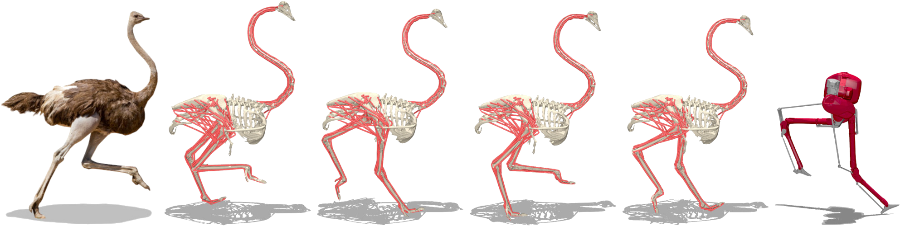

# OstrichRL

<div align="center">
  <br><br>
</div>

This is the repository accompanying the paper **OstrichRL: A Musculoskeletal Ostrich Simulation to Study Bio-mechanical Locomotion**.

It contains models of a musculoskeletal ostrich and of the Cassie robot, motion capture data, and tasks for the [dm_control](https://github.com/deepmind/dm_control) suite:
- ostrich-run
- ostrich-mocap_tracking
- ostrich-foraging
- ostrich-run_torque
- cassie-run
- cassie-mocap_tracking

## Instructions

### To install

Download and install OstrichRL:

```bash
git clone https://github.com/vittorione94/ostrichrl
pip install -e ostrichrl/
```

### To launch experiments

We recommend using the [Tonic RL library](https://github.com/fabiopardo/tonic).

Download and install Tonic:

```bash
git clone https://github.com/fabiopardo/tonic
pip install -e tonic/
```

#### To play with the environments and random actions

```bash
python -m tonic.play --header "import ostrichrl" \
--env "tonic.environments.ControlSuite('ostrich-run')" \
--agent "tonic.agents.UniformRandom()"
```

```bash
python -m tonic.play --header "import ostrichrl" \
--env "tonic.environments.ControlSuite('ostrich-mocap_tracking', task_kwargs=dict(clip='cyclic', test=True, play=True))" \
--agent "tonic.agents.UniformRandom()"
```

```bash
python -m tonic.play --header "import ostrichrl" \
--env "tonic.environments.ControlSuite('ostrich-foraging')" \
--agent "tonic.agents.UniformRandom()"
```

```bash
python -m tonic.play --header "import ostrichrl" \
--env "tonic.environments.ControlSuite('ostrich-run_torque')" \
--agent "tonic.agents.UniformRandom()"
```

```bash
python -m tonic.play --header "import ostrichrl" \
--env "tonic.environments.ControlSuite('cassie-run')" \
--agent "tonic.agents.UniformRandom()"
```

```bash
python -m tonic.play --header "import ostrichrl" \
--env "tonic.environments.ControlSuite('cassie-mocap_tracking', task_kwargs=dict(clip='0100', test=True, play=True))" \
--agent "tonic.agents.UniformRandom()"
```

#### To train

```bash
python -m tonic.train --header "import ostrichrl, tonic.tensorflow" \
--env "tonic.environments.ControlSuite('ostrich-mocap_tracking', task_kwargs=dict(clip='0047'))" \
--test_env "tonic.environments.ControlSuite('ostrich-mocap_tracking', task_kwargs=dict(clip='0047', test=True))" \
--agent "tonic.tensorflow.agents.TD4()" \
--parallel 8 \
--sequential 5
```
